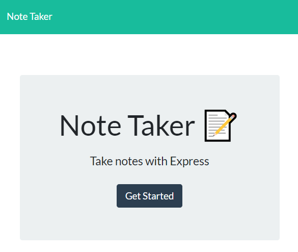
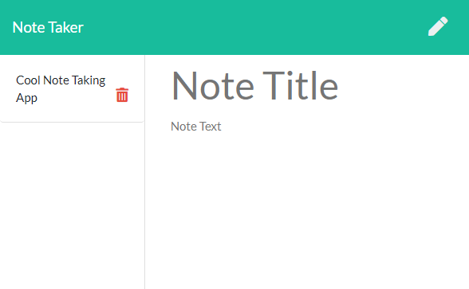

# Note Taker Application

The purpose of this project was to develop an app that would allow the user to take, save, read, and delete notes. This was all done with a json file acting as our storage medium. We created the server file. This allowed us to create all of the routes for the different requests. This was the first app that I have deployed to [heroku](https://secure-ridge-98374.herokuapp.com/). 

